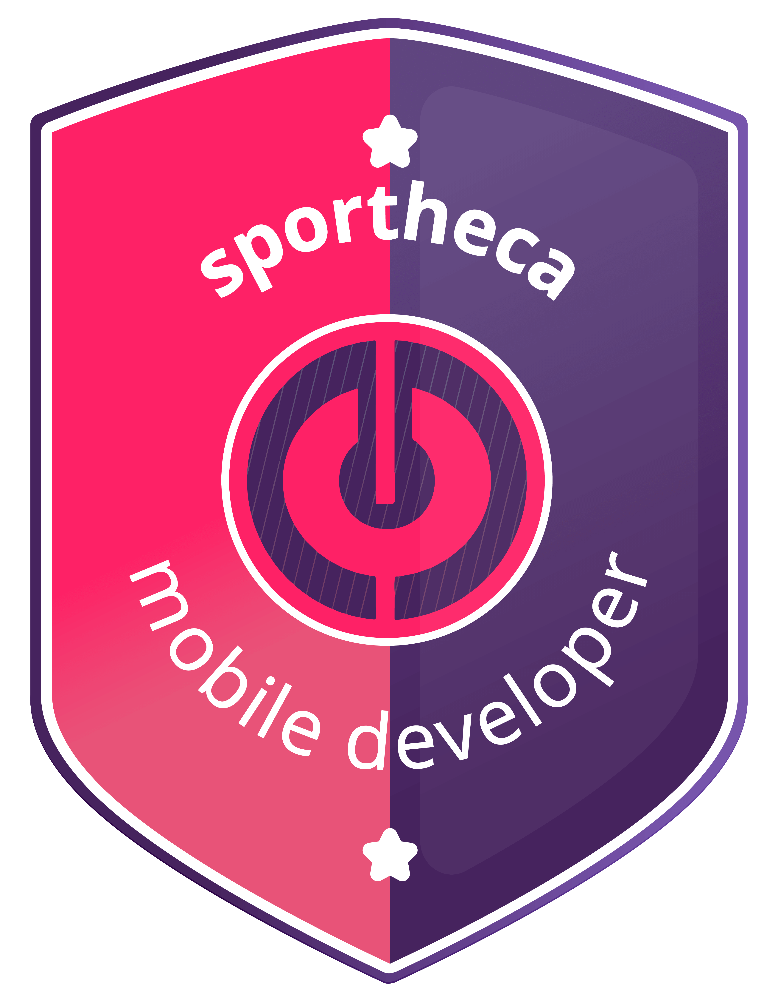

	

 ## Sportheca Mobile Developer
**Hey dev! Já pensou em trabalhar com desenvolvimento para os maiores clubes de futebol do país como Flamengo, Corinthians, Atlético-MG, Fortaleza e muitos outros? Se inscreva no bootcamp Sportheca Mobile Developer, tenha uma trilha completa sobre Java, Kotlin e Android para se tornar um dev mobile de ponta e tenha a chance de trabalhar na gigante Sportheca, que une tecnologia com esporte de ponta no país.**

### 📱 Projetos Feito no Bootcamp
 

#### Projeto 1: [Criando um Banco Digital com Java](link)
- Nesse Projeto foi criado um banco digital utilizando java com Orientação a objetos onde o objetivo principal era reforçar o entendimento de java e Orientação a Objetos.

 

#### Projeto 2: [Match Simulator - Simulador de Partidas](link)
- O Projeto Match Simulartor teve o objetivo de  colocar em pratica tudo que aprendemos nos modulos anteriores,  criando um projeto utilizando Kotlin e java e alguns frameworks como glide e retrofit para   de api.

 

#### Projeto 3: [Criando um cartão de visita em Koltin ](link)
- O Projeto Cartão de visita em kotlin teve o objetivo de colocar em pratica o uso de listagem de dados,  persistência local de dados com o framework Room e compartilhamento de dados.

 

#### Projeto 4: [Criando um app para apresentar um portifolio](link)
- O Projeto teve o objetivo criar um app de listagem de repositorios do github utilizando uma arquitetura robusta e testavel por meio do padrão estrutural MVVM.

 

###  :email: Contato: rafaelnunesmoura@protonmail.com
